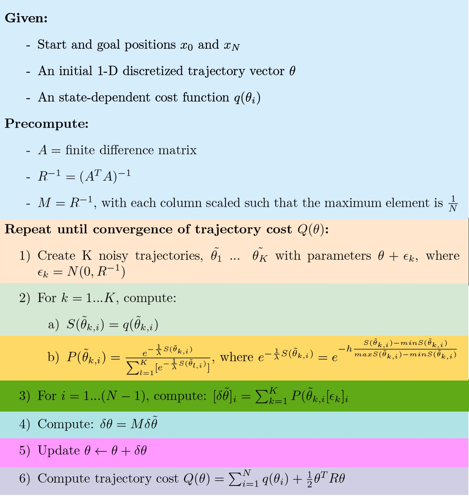
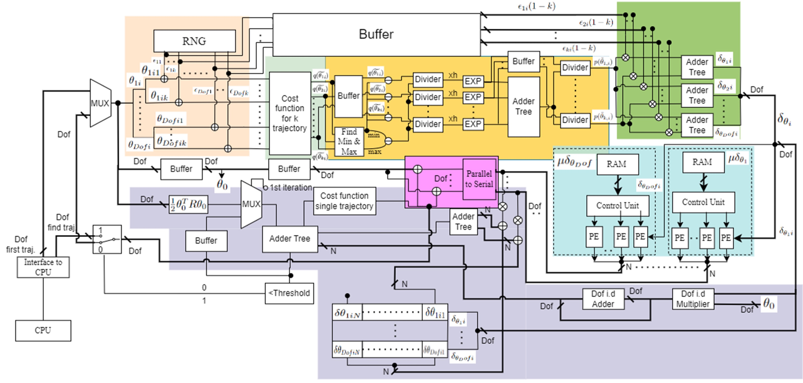
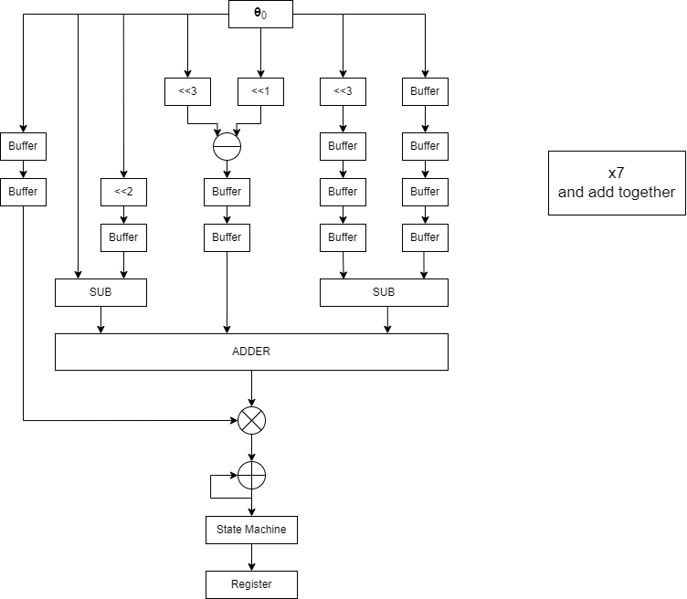
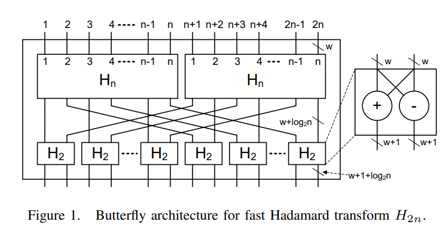
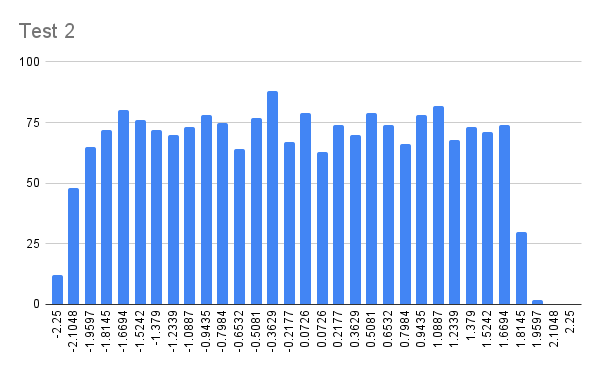
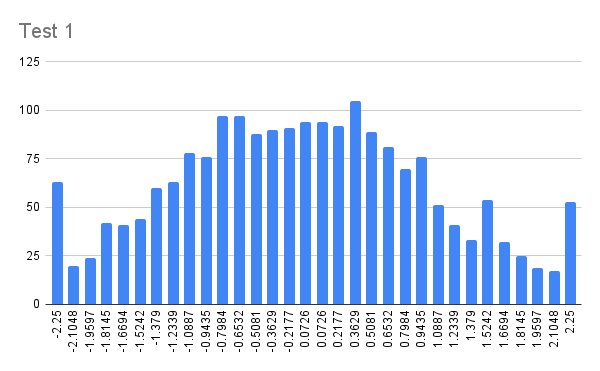
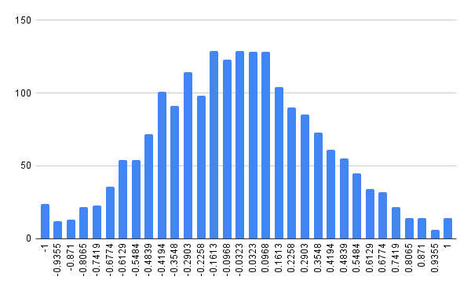

# FPGA-Implementation-of-STOMP-in-Robotics
## Introduction

Welcome to our FPGA implementation of [**STOMP**](https://ieeexplore.ieee.org/stamp/stamp.jsp?tp=&arnumber=5980280&tag=1)(Stochastic Trajectory Optimization for Motion Planning), 
This repository is a part of consultancy Project with  intel  PSG Robotics Technology Group and Imperial College London. The goal of the project was to study the suitability of motion planning algorithm like STOMP or CHOMP when implemented into FPGA. This repositary contains a complete Implementation of STOMP on FPGA based on [**OneAPI**](https://www.intel.com/content/www/us/en/developer/tools/oneapi/data-parallel-c-plus-plus.html) of Intel, which is based on [SYCL](https://www.khronos.org/sycl/). In this documentation you will learn everything there is to know to take over the project. 

## table of content

- [Introduction](#introduction)
- [Project Organisation](#project-organisation)
  - [Work Flow](#workflow)
  - [Functionality of branches](#functionality-of-branches)
  - [Prerequisite](#prerequisite)
- [FPGA Architecture of STOMP](#fpga-architecture-of-stomp)
  - [Introduction to STOMP](#introduction-to-stomp)
  - [General Architecture](#general-architecture)
  - [Some important individual blocks](#some-important-individual-blocks)
      - [Smoothness cost function](#smoothness-cost-function)
      - [Sparse Matrix Multiplication and dot product](#sparse-matrix-multiplication-and-dot-product)
      - [Gaussian Random Number Generator](#gaussian-random-number-generator)
  - [SYCL Code Mapping](#sycl-code-mapping)     
- [How To Run The Code](#how-to-run-the-code)
- [Usefull material for Beginners](#usefull-material-for-beginners)
- [License](#license)


## Project Organisation 
### WorkFlow
Along with studying the suitability of motion planning algorith when implemented into FPGA, the project aimed to design a complete workflow to be able to develop, test and benchmark the fpga implemetentation. In that sense the following workflow has been developed: 


This workflow is the combination of standardized SYCL development flow in OneAPI and ROS2. The FPGA code is first develloped using the emulation compilation and FPGA_early_report provided by OneAPI. The FPGA code can then be The code is then integrated into a ROS2 Workspace, in which simulation can be perform using gazebo (detailed explanation and code are provided in the  [sycl-ros-package branch](https://github.com/Jubo-Xu/FPGA-Implementation-of-STOMP-in-Robotics/tree/sycl-ros-package) branch). The gazebo simulation is meanted for develloper to be able to visually approved their motion planning algorithm, different test cases can be design depending on the appliation needs. In this repo we have setup a simple simulation made of a [3DOF robotic arm](https://github.com/Robotawi/rrr-arm) and a sphere to represent an obstacle. The use of OneApi makes the SYCL code integration into ROS2 really easy for the following points:
* The icpx compiler provided by oneAPI is purelly C++ based but with lots of extra features for SYCL and fpga development, so it could compile any C++ program
* oneAPI provides the cmake package configuration files for all the toolkits and required packages
* The colcon build tool chain used in ROS2 is capable of managing the building process with different compilers for different packages
* ament-cmake is purelly cmake based which means we only need to change the CmakeList to connect the two things

Note that for the remaining part of the workflow[ Quartus Prime Pro ](https://www.intel.co.uk/content/www/uk/en/products/details/fpga/development-tools/quartus-prime.html) is required (it is a license software).
After emulation and ROS2 simulation the FPGA implementation can be simulated using Questa or modelsim. Simulation serve the same purpose as emulation however it give you  much more accurate data than the emulator, but it is much slower than the emulator. After the simulation, the design can be fully compile. The compilation will first enable you to take a look at the FPGA hardware image report which is analogous to early image report but contains much more precise information about resource utilization and fMAX numbers. From the compilation you will also be able to the bitstream into an actual FPGA. In our case this is done throught the [DevCloud](https://devcloud.intel.com/oneapi/home/) as all the setup is handle for us.  More information about accessing the devcloud in the next section. 

Additionally a CPU version has also been develloped for Benchmarking purposes, the cpu version can be also simulatated in ROS2 and upload on the devcloud. Every information regarding the CPU_version is available  on the [STOMP_CPU_VERSION](https://github.com/Jubo-Xu/FPGA-Implementation-of-STOMP-in-Robotics/tree/STOMP_CPU_VERSION) branch.

On the long term, our ambition is to setup an opensource platform for the public to develop their own projects for the FPGA implementation in robotics.

### Functionality of branches 
There are three main branches in our repo right now, each has different funcitonality and purpose with corresponding code, as explained below:
* master ---> contains the introduction and explanation for FPGA architecture and SYCL code independently
* sycl-ros-package ---> contains the explanation of connection between ROS2 and SYCL and the code
* STOMP_CPU_VERSION ---> contains the CPU version code of STOMP tested in our case
* ros2_STOMP_pkg ---> contains the package of our ROS2 environment setup for our test case
* test ---> contains the test code for all the FPGA kernels in SYCL and their corresponding static report


### Prerequisite
As always with FPGA there is a lot of tooling involved, be ready to spend hours debuging them (especially to access the devcloud) but don't lose hope because in the end it will work. 

First of all it is highly recommended to use this workflow within a Ubuntu operating system. Virtual Machine can work but it is important to be aware that at least 200Gb is required to download all the software (most of it is quartus).   

#### Visual Studio Code (Vscode)
Visual Studio Code is essential in our workflow as it centralized all the other software, this mean that theorically you will able to control every thing through Vscode such as ROS2, devcloud, emulation, simulation, compilation,... 
If not done already here is the to download page for [Vscode](https://code.visualstudio.com/Download). 

#### CMake
Make sure to download [CMake](https://cmake.org/download/) as it use extensively in this project. Make sure also to add the Vscode extension called "CMake Tools". 

#### OneApi

In order to use OneApi in Visual Studio you will need to download [OneApi base toolkit](https://www.intel.com/content/www/us/en/developer/tools/oneapi/toolkits.html#base-kit), this will download the icpx compiler which is use to compile sycl code. In order to used it within Vscode you will also need to add the extension in Visual studio code. The extension is called "Extension Pack for Intel(R) oneAPI Toolkits".

> **Note**: If you are on windows you will also need to downloads Visual Studio which is not be confuse with Vscode. When you download Visual Studio make sure to download C++ developement desktop. 


#### Quartus Prime Pro and Questa or ModelSim
As mention Quartus Prime Pro is required to simulate and perform a hardware compilation of your code you can refer to [intel documention](https://www.intel.com/content/www/us/en/docs/oneapi/programming-guide/2023-0/evaluate-your-kernel-through-simulation.html) for 

#### ROS2
ROS2 Humble was use throughout the project. In order to download it you follow the instruction on the [ROS2 website](https://docs.ros.org/en/humble/Installation/Ubuntu-Install-Debians.html). Additionally 2 package are also required: 
- [ros2-control](#)
- [ros2-gazebo-control](#)

**Note**: You can change the default target by using the command:
``` sudo apt install ros2-humble-package-name  ```
    


## FPGA Architecture of STOMP
This section is mainly used to explain the hardware architecture we designed for STOMP, and also how these different hardware blocks are mapped to SYCL code. 
### Introduction to STOMP
Stochastic Trajectory Optimization for Motion Planning (STOMP) is a probabilistic optimization framework (Kalakrishnan et al. 2011). STOMP produces smooth well behaved collision free paths within reasonable times. The approach relies on generating noisy trajectories to explore the space around an initial (possibly infeasible) trajectory which are then combined to produce an updated trajectory with lower cost. A cost function based on a combination of obstacle and smoothness cost is optimized in each iteration. No gradient information is required for the particular optimization algorithm that we use and so general costs for which derivatives may not be available (e.g. costs corresponding to constraints and motor torques) can be included in the cost function. The figure below is the pseudo-code of STOMP: 
<p align="middle">

</p>

### General Architecture
<center>

<center>

The above figure shows the general hardware architecture of STOMP. The individual hardware blocks and the corresponding pseudo code part are mapped by the same color section. There are three important parameters in STOMP algorithm:
* k ---> number of noisy trajectories
* DoF ---> number of degree of freedom of robotics arm
* N ---> number of step points of the trajectory

Normally, N could be very large, which can reach the value of 128 and 256, therefore it's impossible to make all step points be processed in parallel which would require too much resources. The why we do is to make the whole architecture be fully pipelined and stream in the value of all DoF at each time step one by one, at each clock cycle. Besides, STOMP would iterate lots of times which means there would be a loop structure of the hardware architecture, which would add lots of latencies if it's for real-time streaming, but since STOMP is also a precomputing algorithm, we only need to have the input from the host(CPU lets say) in the first iteration, later all the input would be from the output, then the whole loop would still be fully pipelined.

### Some important individual blocks
This section mainly explains some important individual blocks.

#### 1. Smoothness cost function
Initially the smoothness cost function is given as $\frac{1}{2}\theta^TR\theta$ this matrix multiplication can be decompose to accelerate the computation.
The equations can be represented as:

$$
\begin{align*}
\theta^TR\theta &= ( \theta_0 + \delta\theta)^TR( \theta_0 + \delta\theta) \\
&= \theta_o^TR\theta_o + \theta_o^TR\delta\theta \\
&= (\theta_o^{T}+\delta\theta^T)R(\theta_o+\delta\theta) \\
&= \theta_o^TR\theta_o+\theta_o^TR\delta\theta+\delta\theta^TR\theta_o+\delta\theta^T\delta\theta \\
\delta\theta &= M\delta\tilde{\theta} = \frac{1}{N}R^-\delta\tilde{\theta} \\
\theta_o^TR\delta\theta &= \theta_o^TR(\frac{1}{N}R^-\delta\tilde{\theta})= \frac{1}{N}\theta_o^T\delta\tilde{\theta} \\
\delta\theta^TR\theta &= \frac{1}{N}\delta\tilde{\theta}^T(R^-)^TR\theta_o =\frac{1}{N}\theta_o^T\delta\tilde{\theta} \\
\delta\theta^TR\delta\theta &= \frac{1}{N^2}(R^-\delta\tilde{\theta})^TR(R^-\delta\tilde{\theta}) = \frac{1}{N^2}\delta\tilde{\theta}^TR^{-1}\delta\tilde{\theta}
\end{align*}
$$

The overall equation yields to: 

$$
\begin{equation}
   \frac{1}{2}\theta^TR\theta  =  \frac{1}{2}\theta_0^TR\theta_0 + \frac{1}{N}\delta\tilde{\theta}^T\theta_0+\frac{1}{N^2}\delta\tilde{\theta}R^{-1}\delta\tilde{\theta}
\end{equation}
$$

and can be implemented in hardware as: 

<p align="middle">

</p>
  
The decomposition presented in above equation decreases the number of operations to be computed.  $\frac{1}{2}{\theta _0}^TR\theta _0$  is computed in the previous iteration and can be stored in a buffer, then  $\frac{1}{N}\delta\tilde{\theta}R^-\delta\tilde{\theta}$  can be rewritten as   $\delta\tilde{\theta}^TM\delta\tilde{\theta}$ where $M\delta\tilde{\theta}$  is also needed in updating the new trajectory. In the hardware architecture presented, the matrix multiplication  $M\delta\tilde{\theta}$  is performed in N cycle and is parallel out  (all the elements are output at the same time). The vector multiplication  $\delta\tilde{\theta}^TM\delta\tilde{\theta}$  is performed in parallel in 1 cycle and then added by an adder tree in one cycle. The overall time complexity of this implementation is evaluated at  $O(N)+O(logN)$.

#### 2. Sparse Matrix Multiplication and dot product
After the decomposition of the smoothness cost function, we need to calculate the $\frac{1}{2}{\theta _0}^TR{\theta _0}$ in the first iteration, R is a sparse diagonal matrix, and our input is streaming in in the pipelined way, it's uneccessary to do the whole matrix multiplication for it using PE arrays. The way we design it is in this way:
<p align="middle">

</p>

For this architecture, we could do the whole matrix multiplication with only a little bit resources and considering about the boundery condition easily. Sparse diagonal matrix multiplication is quite common in robotics motion planning algorithms, like finite difference matrix representing velocity or acceleration. Therefore, this architecture can be generalized and good to use.

#### 3. Gaussian Random Number Generator
RNG itself is a big area and requires lots of research. Since STOMP itself is mainly a precomputing algorithm served as a starting point of a whole robotics system, the simplest design with lowest hardware resources but relatively low latency should be used. In our case, we tried 4 different ways of implementing RNG:
1. Look Up table
2. Picewise Linear approximations
3. Picewise Linear approximations + Hadmard Transform Network
4. Triangular distribution RNG + Hadmard Transform Network

For the first one, again, since STOMP is a precomputing algorithm, if the iteration we use is a fixed number, then the total number of samples we need once is $\(N \cdot k \cdot DoF \cdot Iteration\)$, and these samples can be reused for next computing. This way is easy to be implemented but the number of samples is too large to be implemented in registers, we have to use Memory blocks which would add additional complexity and latencies. 

The second Picewise Linear approximations is mainly using multiple linear distributions to approximate Gaussian one based on certain probabilities and choosen by Walker Alias Table. Both Alias Table and linear distribution need Uniform RNG. The 32 bit Uniform RNG used in our case is based on [LUT-SR-RNG](https://cas.ee.ic.ac.uk/people/dt10/research/thomas-10-lut_sr_rngs.pdf), and the Linear Approximation(Triangular Distribution in our case) is based on the following [paper](https://ieeexplore.ieee.org/document/6861609). 
<p align="middle">

</p>
The Hadmard Transformation network is good to use because after going through this network we could get multiple samples at the same time, these samples are still independent to each other and have the probability distribution closer to Gaussian due to Central Limit Theorem. The last one we tried is simply the triangular RNG which can be constructed by two uniform RNGs and Hadmard Transform network. 
<p align="middle">
  
   
  
</p>

The leftmost figure is the probability distribution of picewise linear approximation only, and the middle one is that of the picewise linear with Hadmard transform network, and the rightmost one is that of the triangular distribution with the Hadmard transform. It can be seen that the effect of Hadmard transform is quite significant, the picewise linear + hadmard tranform case requires too much resources and even need several minutes to run for emulation. Since after testing, STOMP is not that sensitive to RNG, the RNG we finally used is the last case.

### SYCL Code Mapping
<p align="middle">

</p>

The figure above shows the SYCL mapping of the hardware architecture, each hardware blocks are written or seperated into several autorun kernels in SYCL, and they are connected by single pipes or pipearrays. The numbers on the figure represent the pipes defined in the main.cpp:
1.  pipe_host_2_input
2.  pipearray_last_2_input
3.  pipearray_end_sig
4.  pipearray_input_2_noisy
5.  pipearray_input_2_update
6.  pipearray_input_2_sparse
7.  pipearray_input_2_smooth 
8.  pipearray_RNG_out1
9.  pipearray_RNG_out2_2_DT3
10. pipearray_noisy_out
11. pipearray_obscost_out
12. pipearray_DT_1_2
13. pipearray_DT_2_3 
14. pipearray_DT_out_2_MMUL
15. pipearray_DT_out_2_smooth
16. pipearray_MMUL_out1
17. pipearray_MMUL_out2
18. pipearray_update_out 
19. pipearray_sparse_2_smooth
20. pipe_smooth_2_determ
21. pipe_obcost_single_cost
22. pipearray_obcost_single_theta
23. pipe_last_2_host
> **Note:** AR_RNG kernel is composed of two seperate kernels: AR_rng_n1024_r32_t5_k32_s1c48_delta_0_25_test and Hadmard_Transform_16, with an additional pipe to  connect them: pipe_delta_rng1.

## How to run the code 

> **Note**: When working with the command-line interface (CLI), you should configure the oneAPI toolkits using environment variables. 
> Set up your CLI environment by sourcing the `setvars` script located in the root of your oneAPI installation every time you open a new terminal window. 
> This practice ensures that your compiler, libraries, and tools are ready for development.
> All the following parts assuming oneAPI toolkits are installed locally, but for simulation and hardware compilation, devcloud should be connected, and Quartus prime pro is also needed.
> 
> Linux*:
> - For system wide installations: `source /opt/intel/oneapi/setvars.sh`
> - For private installations: ` . ~/intel/oneapi/setvars.sh`
> - For non-POSIX shells, like csh, use the following command: `bash -c 'source <install-dir>/setvars.sh ; exec csh'`
>
> Windows*:
> - `C:\Program Files(x86)\Intel\oneAPI\setvars.bat`
> - Windows PowerShell*, use the following command: `cmd.exe "/K" '"C:\Program Files (x86)\Intel\oneAPI\setvars.bat" && powershell'`
>
> For more information on configuring environment variables, see [Use the setvars Script with Linux* or macOS*](https://www.intel.com/content/www/us/en/develop/documentation/oneapi-programming-guide/top/oneapi-development-environment-setup/use-the-setvars-script-with-linux-or-macos.html) or [Use the setvars Script with Windows*](https://www.intel.com/content/www/us/en/develop/documentation/oneapi-programming-guide/top/oneapi-development-environment-setup/use-the-setvars-script-with-windows.html).

### Building the STOMP sample
#### On Intel® DevCloud using Batch Job Submission (Recommended)

1. To connect to DevCloud, follow documentations for [connecting to DevCloud with OpenSSH (Windows)](https://devcloud.intel.com/oneapi/documentation/connect-with-ssh-windows-openssh/) or [connecting to DevCloud (Linux/MacOS)](https://devcloud.intel.com/oneapi/documentation/connect-with-ssh-linux-macos/).

2. In the repository directory, create a script file called build_fpga.sh, paste the following code and save.
    ```
    #!/bin/bash

    echo "Set Quartus directory override"
    source /opt/intel/oneapi/setvars.sh
    export QUARTUS_ROOTDIR_OVERRIDE=/glob/development-tools/versions/intelFPGA_pro/19.2/quartus
    
    echo "Move into build folder"
    mkdir build
    cd build
    
    echo "Remove cache"
    rm CMakeCache.txt
    
    echo "Clean and set target"
    cmake clean ..
    cmake -DFPGA_DEVICE=intel_s10sx_pac:pac_s10 ..
    
    echo "Start make"
    make fpga
    
    echo "End of bash script"
    ```
   This script is used to compile for FPGA hardware. To compile for emulation, simulation, or generate optimisation report, replace `make fpga` with `make fpga_emu`, `make fpga_sim` and `make report` respectively.
3. Grrant execute permissions to the script
    ```
    chmod +x build_fpga.sh
    ```
4. To submit the script to DevCloud, use the command
   ```
   qsub -l walltime=23:59:59 -l nodes=1:fpga_runtime:stratix10:ppn=2 -d . build_fpga.sh -o build_fpga.o.log -e build_fpga.e.log
   ```

#### On a Linux System or with Intel® DevCloud's Interactive Mode
> **Note**: This branch already contains the build folder with executable .fpga_emu file, for quick check you could directly go to the build folder and run `./stomp.fpga_emu` to see the result. For personal uses, you could delete the `build` folder and go through the following process.

> **Note**: If using Intel® DevCloud's Interactive Mode, request a compute node using the command `qsub -I -l walltime=23:59:59 -l nodes=1:fpga_runtime:stratix10:ppn=2 -d .` and follow the rest of the instructions.


1. Generate the `Makefile` by running `cmake`.
    ```
    mkdir build
    cd build
    ```
    To compile for the default target (the Agilex® device family), run `cmake` using the command:
    ```
    cmake ..
    ```

    > **Note**: You can change the default target by using the command:
    >  ```
    >  cmake .. -DFPGA_DEVICE=<FPGA device family or FPGA part number>
    >  ``` 
    >
    > Alternatively, you can target an explicit FPGA board variant and BSP by using the following command: 
    >  ```
    >  cmake .. -DFPGA_DEVICE=<board-support-package>:<board-variant> -DIS_BSP=1
    >  ``` 
    >
    > You will only be able to run an executable on the FPGA if you specified a BSP.
    > 
    > Using Stratix® 10 is highly recommended (`-DFPGA_DEVICE=intel_s10sx_pac:pac_s10`).

2. Compile the design through the generated `Makefile`. The following build targets are provided, matching the recommended development flow:

   * Compile for emulation (fast compile time, targets emulated FPGA device, mainly used in our case):
      ```
      make fpga_emu
      ```
   * Generate the optimization report:
      ```
      make report
      ```
   * Compile for simulation (medium compile time, targets simulated FPGA device):
      ```
      make fpga_sim
      ```
   * Compile for FPGA hardware (longer compile time, targets FPGA device):
      ```
      make fpga
      ```

#### On a Windows System
> **Note**: might has some issues depending on the environment setup, linux system is recommended.

1. Generate the `Makefile` by running `cmake`.
    ```
    mkdir build
    cd build
    ```
    To compile for the default target (the Agilex® device family), run `cmake` using the command:
    ```
    cmake -G "NMake Makefiles" ..
    ```
    > **Note**: You can change the default target by using the command:
    >  ```
    >  cmake -G "NMake Makefiles" .. -DFPGA_DEVICE=<FPGA device family or FPGA part number>
    >  ``` 
    >
    > Alternatively, you can target an explicit FPGA board variant and BSP by using the following command: 
    >  ```
    >  cmake -G "NMake Makefiles" .. -DFPGA_DEVICE=<board-support-package>:<board-variant> -DIS_BSP=1
    >  ``` 
    >
    > You will only be able to run an executable on the FPGA if you specified a BSP.
    > 
    > Using Stratix® 10 is highly recommended (`-DFPGA_DEVICE=intel_s10sx_pac:pac_s10`).

2. Compile the design through the generated `Makefile`. The following build targets are provided, matching the recommended development flow:

   * Compile for emulation (fast compile time, targets emulated FPGA device):
     ```
     nmake fpga_emu
     ```
   * Compile for simulation (medium compile time, targets simulated FPGA device):
     ```
     nmake fpga_sim
     ```
   * Generate the optimization report:
     ```
     nmake report
     ```
   * Compile for FPGA hardware (longer compile time, targets FPGA device):
     ```
     nmake fpga
     ```
### Examining the Reports
Locate `report.html` in the `STOMP_report.prj/reports/` directory. Open the report in Chrome*, Firefox*, Edge*, or Internet Explorer*.

From the report, you can find the compilation information of the design and the estimated FPGA resource usage. For example, navigate to the Area Analysis section of the report (**Kernel System > BasicKernel > Computation**), and you can see the estimated resource usage (ALUTs, FFs, RAMs, etc.) for each kernel being called.

### Running the Sample

1. Run the sample on the FPGA emulator (the kernel executes on the CPU):
     ```
     ./stomp.fpga_emu     (Linux)
     stomp.fpga_emu.exe   (Windows)
     ```
2. Run the sample on the FPGA simulator:
    * On Linux
        ```
        CL_CONTEXT_MPSIM_DEVICE_INTELFPGA=1 ./stomp.fpga_sim
        ```
    * On Windows
        ```
        set CL_CONTEXT_MPSIM_DEVICE_INTELFPGA=1
        stomp.fpga_sim.exe
        set CL_CONTEXT_MPSIM_DEVICE_INTELFPGA=
        ```
3. Run the sample on the FPGA device (only if you ran `cmake` with `-DFPGA_DEVICE=<board-support-package>:<board-variant>`):
     ```
     ./stomp.fpga         (Linux)
     stomp.fpga.exe       (Windows)
     ```

### Example of Output
```
Let's go: 
Running on device: Intel(R) FPGA Emulation Device
Running the Autorun kernel test
submit finished
output is: 
0.250338,
1.72413,
0.656498,
0.195149,
1.74207,
0.740129,
0.124593,
1.76519,
0.843125,
0.0489984,
1.78696,
0.948945,
-0.0197424,
1.80285,
1.04346,
-0.0774015,
1.81226,
1.1164,
-0.113908,
1.81289,
1.16267,
-0.123814,
1.80412,
1.17968,
-0.107353,
1.78154,
1.1657,
-0.0642622,
1.74274,
1.12044,
0.00622619,
1.69426,
1.04573,
0.105203,
1.6368,
0.945953,
0.231254,
1.575,
0.831565,
0.37387,
1.51419,
0.712576,
0.515834,
1.45807,
0.600004,
0.640424,
1.41223,
0.508046,

finished 
```
> **Note**: The output is the final trajectory we generated, in our case, we tested that for a robotics arm with 3 DoF, and the number of timesteps for trajectory is 16, therefore the total number of output is 48.

## Usefull material for Beginners 

### OneApi 
To start go through the [DPC++ book](https://link.springer.com/book/10.1007/978-1-4842-5574-2), this will teach all about memory, code structure, kernels, ... Then to get familiar with SYCL for targeting FPGA refer to the github page [SYCL-FPGA documentation](https://github.com/oneapi-src/oneAPI-samples/tree/master/DirectProgramming/C++SYCL_FPGA). Additionally you can also look at the intel video on OneAPI but they oftem miss important suptility.  
### ROS2
If you want to know more about how to setup a gazebo ros2 simulation refer to [articulated robotic](https://www.youtube.com/watch?v=4QKsDf1c4hc&t=1304s&ab_channel=ArticulatedRobotics) and [The Construct](https://www.youtube.com/watch?v=lo1bXm8Aoqc&t=529s&ab_channel=TheConstruct) on Youtube. ROS2 documentation is also well written and of great use.

## License

Code samples are licensed under the MIT license. See [LICENSE](https://github.com/Jubo-Xu/FPGA-Implementation-of-STOMP-in-Robotics/blob/master/LICENSE) for details.
