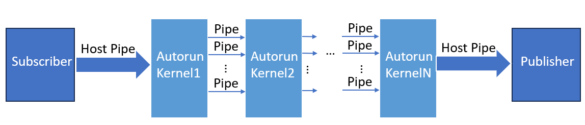
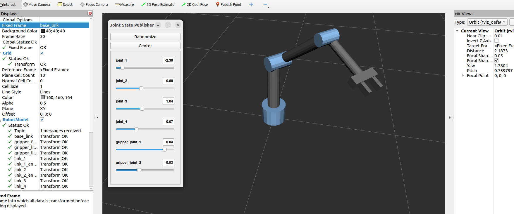

# Bridge between SYCL for FPGA and ROS2 for Robotics
This branch contains the code that connect the SYCL code for FPGA design and ROS2 code for Robotics simulation together. Since SYCL is purely based on C++, and the compiler ICPX we used for oneAPI is also the C++ compiler with extra features mainly for accelerator design, it's possible to connect them together. 

## Explaination of workflow
This section mainly explains how we connect these two things together and how we use this connection to test our FPGA Implementation for Robotics.

### FPGA Kernel package
A seperate ROS2 package is created for all of the FPGA codes. The package name in the provided code is sycl_fpga_kernel. The structure of this package is like this: 
* CMakeLists.txt and package.xml are modified such that the code would be compiled by icpx compiler provided by oneAPI, and the .fpga_emu execution file would be generated.
* One source file contains the publisher and a subscriber, which is mainly used for testing of this package
* Another source file contains the publisher and subscriber and also the SYCL code

Publisher and Subscriber mechanism of ROS2 is used to connect with the SYCL kernels. Since the publisher could publish some data to a topic continously and infinitely except we set a condition for it to only send certain numbers of data, and the sending frequency can be set inside the publisher class. Subscriber could also subscribe to the same topic and getting the data continuously from the publisher, therefore, the publisher and subscriber mechanism is a good candidate for data streaming. 

Since all the FPGA code are written in [autorun kernels](https://github.com/oneapi-src/oneAPI-samples/tree/master/DirectProgramming/C%2B%2BSYCL_FPGA/Tutorials/DesignPatterns/autorun) in SYCL, these kernels could run continuously and infinitely as long as there is data pumped in. The data streaming between kernels are based on pipes. Since the kernels are for device, we need to find a way to send this data to the device from host. The normal way to do this for autorun kernels is initializing all the needed data into a vector and creating a buffer for it, then send that buffer to the device through queue, like following code: 

```c++
template <typename KernelID, typename Pipe>
sycl::event SubmitProducerKernel(sycl::queue& q, sycl::buffer<float, 1>& in_buf) {
  return q.submit([&](sycl::handler& h) {
    sycl::accessor in(in_buf, h, read_only);
    int size = in_buf.size();
    h.single_task<KernelID>([=] {
      for (int i = 0; i < size; i++) {
        Pipe::write(in[i]);
      }
    });
  });
}
```

After doing all the operations inside the autorun kernels, the data would be send back to the host in the same way: 

```c++
template <typename KernelID, typename Pipe>
sycl::event SubmitConsumerKernel(sycl::queue& q, sycl::buffer<float, 1>& out_buf) {
  return q.submit([&](sycl::handler& h) {
    sycl::accessor out(out_buf, h, write_only, no_init);
    int size = out_buf.size();
    h.single_task<KernelID>([=] {
      for (int i = 0; i < size; i++) {
          out[i] = Pipe::read();
      }
    });
  });
}
```

This is good enough for the designing and testing of FPGA in SYCL independently, but since we are trying to connect ROS2 with SYCL to mimic the operations, this would reduce the execution speed. Thanks to the host pipe API provided by oneAPI, we could define the subscriber class in the following way:

```c++
template <typename Pipe>
class MinimalSubscriber : public rclcpp::Node
{
public:
  MinimalSubscriber(sycl::queue &q)
  : Node("minimal_subscriber"), index(0), queue_(q)
  {
    subscription_ = this->create_subscription<tutorial_interfaces::msg::Num>(    
      "topic", 20, std::bind(&MinimalSubscriber::topic_callback, this, _1));
  }
  mutable float receive[DoF_main*N_main];

private:
  void topic_callback(const tutorial_interfaces::msg::Num & msg) const 
  {
    receive[index] = msg.num;
    std::cout<<"check: "<<msg.num<<std::endl;
    Pipe::write(queue_, msg.num);
    
    index++;
    if (index >= DoF_main*N_main) {
      RCLCPP_INFO(this->get_logger(), "Received all values. Stopping subscriber.");
      rclcpp::shutdown();
    }
    
  }
  rclcpp::Subscription<tutorial_interfaces::msg::Num>::SharedPtr subscription_; 
  mutable size_t index;
  sycl::queue& queue_;
};
```

The pipe used in this class is host pipe and defined by ```sycl::ext::intel::prototype::pipe<Pipe ID, data type, minimum capacity>;```. By defining the class in this way, after subscribe get one data from the publisher it then directly send that data to the autorun kernels through host pipe defined. This mimic the host data streaming and the pipelined working process of the hardware. After the operation of autorun kernels, the output data will be sent to the publisher class through another host pipe, and then be published to another topic. The general architecture is like this:

<p align="middle">

</p>

The advantage of this mechanism is that it's easier to be extended. In our case, we only need to transmit the initial trajectory and final trajectory which are float numbers with fixed length, but in some complex cases, maybe multiple data from different sensor need to be sent to the FPGA continuously at the same time, multiple publishers and subscribers with different topics can be used to streaming the data to the kernel at the same time. These subscribers and publishers can be put into different threads. 

### Other packages
The package of sycl code is defined in a completely independent package and the communication between this package and other packages is through publisher and subscriber. This makes sure that FPGA code are contained together in a seperate package which can be replaced easily without changing the code for other packages. This FPGA package is put into the same ROS2 workspace as other packages. Therefore, the FPGA kernel package can be assumed as a software representation of FPGA, and all other packages can be assumed as the softare representation of Robotics, the sensors, and the environment. The software representation of hardware interface between Robotics and FPGA is publisher and subscriber mechanism. In the workspace provided in this branch, an important package is my_bot package, which contains the 3D model of our testing robotic arm as well as all the launch files and configuraton files needed. The detailed explanation of the test case is in the following section. The basic structure of the source file of my_bot package is:
* starting point and ending point can be set manually by changing two vectors
* initial trajectory is generated by linear interpolation
* publisher and subscriber work in two threads, pub thread publish the initial trajectory while the sub thread subscribes the final trajectory generated by FPGA
* after sub thread gets all the data for final trajectory, it would invoke the action thread, which would execute the trajectory in Gazebo through action

## Explanation of test case
The test case we used is:
* A 3 DoF robotic arm, as shown in the following figure.
* Number of timesteps of trajectory is 16.
* Number of noisy trajectory is 4.
* Number of iterations for FPGA implementation of STOMP is 50
* A single sphere obstacle with known position and radius.

<p align="middle">

</p>

### Obstacle cost function
The cost function used here is only the obstacle cost function. Since we know the position of the sphere obstacle, the minimum distance between a point on robotic arm and the surface of the sphere obstacle can be calculated by this equation:

$$
\begin{equation*}
d_p = sqrt{(x_p-x_c)^2+(y_p-y_c)^2+(z_p-z_c)^2}-r_o
\end{equation*}
$$

where  $x_p, y_p, z_p$  are coordinate of that point, and  $x_c, y_c, z_c$  are the x, y, z position of the center of the sphere, and  $r_o$  is the radius of sphere obstacle. The x, y, z position of the point are calculated by forward kinematics. In our case, since the robotic arm is 3 DoF, we calculate the distance for two points, one is the end effector, another point is at the third joint. The forward kinematics to calcualte the x, y, z position of these two points is:

$$
\begin{align*}
x_1 = L_2\sin(\theta _2)\sin(\theta _1)+M_1\sin(\theta _1)
y_1 = -(L_2\sin(\theta _2)\cos(\theta _1)-M_1\cos(\theta _1))
z_1 = L_1+L_2\cos(\theta _2)

x_2 = (L_2\sin(\theta _2)+L_3\sin(\theta _2+\theta _3))\sin(\theta _1)+M_2\sin(\theta _1)
y_2 = -(L_2\sin(\theta _2)+L_3\sin(\theta _2+\theta _3))\cos(\theta _1)+M_2\sin(\theta _1)
z_2 = L_1+L_2\cos(\theta _2)+L_3\cos(\theta _2+\theta _3)
\end{align*}
$$

where  $L_1, L_2, L_3$  are the length of link1, link2, and link3, and  $M_1, M_2$  are the length of the first and second offset on the robotic arm. 

After calculating the distance, the cost function can be calculated by:

$$
\begin{equation}
\sum_{b\in B} max(\epsilon +r_b-d(x_b), 0)\|\dot{x_b}\|
\end{equation}
$$

where B is equal to 2 in our case, and  $\|\dot{x_b}\|$  is calculated based on  $sqrt{(x_p - {x_p}^*)^2+(y_p - {y_p}^*)^2+(z_p - {z_p}^*)^2}$  , where  ${x_p}^*, {y_p}^*, {z_p}^*$  are x, y, z position at last timestep. 

The cost function calculated used here is for the simplest case, later this can be changed to a more complex case. But since the costfunction in SYCL code is a completely seperate block, it can be changed and replaced easily without changing the following part of STOMP algorithm. 

## How to run the code
1. clone the code:
```bash
    git clone -b sycl-ros-package https://github.com/Jubo-Xu/FPGA-Implementation-of-STOMP-in-Robotics.git
```

2. direct to the folder of the workspace, setting up the environment variables
```bash
    source install/setup.bash
    source /opt/intel/oneapi/setvars.sh
```

3. build the whole workspace
```bash
    colcon build
```
>**Note**: after modifying the code, adding new packages, especially modify the CMakeLists.txt, it's better to remove the build folder under the root folder of the workspace, and maybe also need to remove the folder named after certain packages inside the install folder, and re-create a new build folder and re-build, otherwise, the old make files may be stored in the cache and cause errors

4. under the root folder of workspace, launch the Gazebo
```bash
    ros2 launch my_bot launch_sim.launch.py world:=src/my_bot/worlds/empty.world
```

5. open a new terminal, move to the root folder of the workspace, source both the ros and oneapi, and then move to the sycl_fpga_kernel under the build folder, and run the execution file
```bash
    cd build
    cd sycl_fpga_kernel
    ./fpga_kernel.fpga_emu
```

6. open a new terminal, move to the root folder of the workspace, source both the ros and oneapi, and then move to the my_bot under the build folder, and run the execution file
```bash
    cd build
    cd my_bot
    ./joint_command
```
>**Note**: it's important to first run the fpga_kernel.fpga_emu first, wait for a while, if there's "Instantiation finished, let's go:" on the terminal, then run the join_command. This is because the instantiation of kernels and subscriber take time, we need to wait for the instantiation finished, otherwise the subscriber cannot get all the data being sent, and the pipe would be blocked, it will not run properly.

7. after running the above commands, the terminal of joint command should first publish some numbers, and the fpga_kernel terminal would show these numbers at the same time, then it would go for the fpga execution, and then publish back, then the robotic arm in the Gazebo would move correspondingly. 

## License

Code samples are licensed under the MIT license. See [LICENSE](https://github.com/Jubo-Xu/FPGA-Implementation-of-STOMP-in-Robotics/blob/master/LICENSE) for details.
